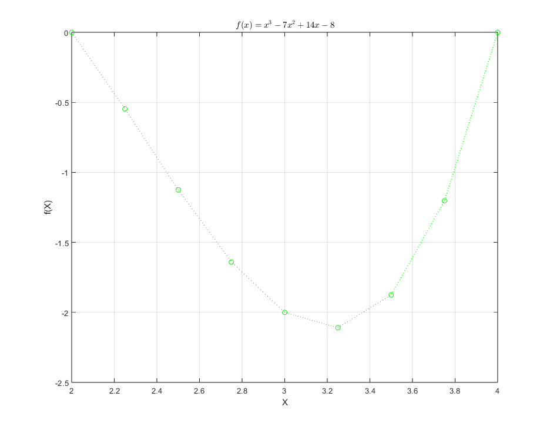
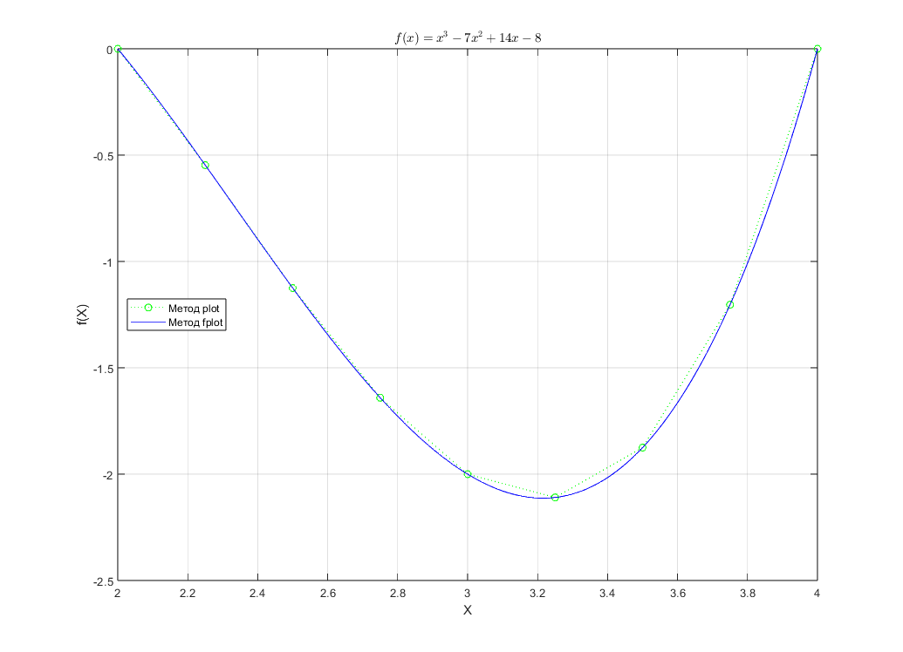
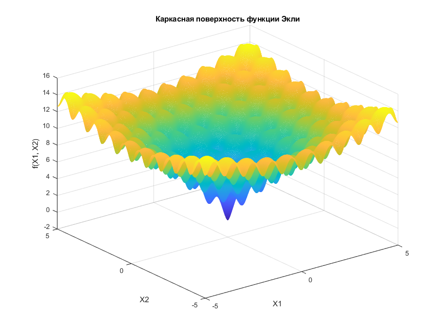
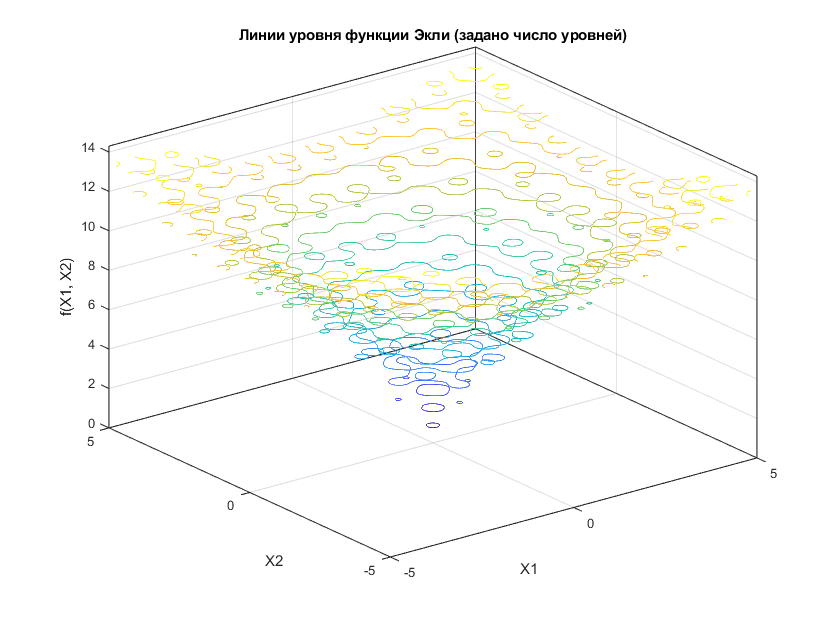
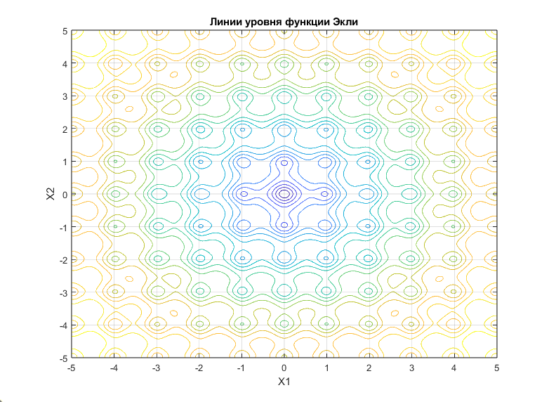
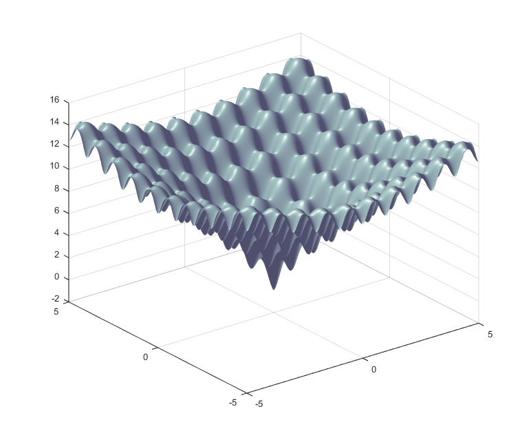
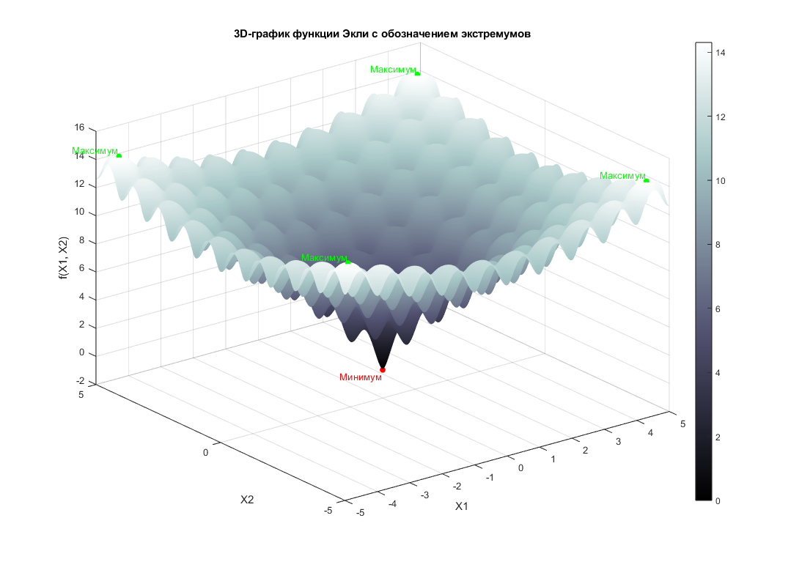
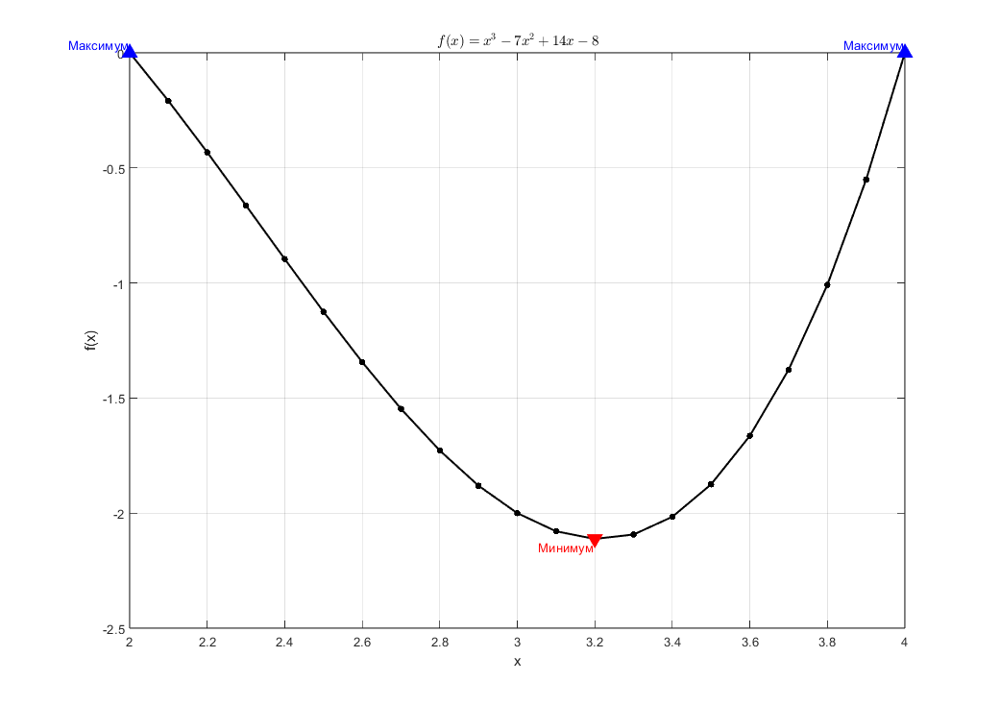

# Методы оптимизации и исследование операций / Optimization Methods and Operations Research  

## 📌 Лабораторные работы №1–3 / Laboratory Works №1–3  

### 🎯 Цель курса / Course Objective  
Освоение методов оптимизации и исследования операций, а также приобретение практических навыков применения MATLAB для решения задач одномерной, многомерной и дискретной оптимизации.  
/  
To study optimization methods and operations research, and to acquire practical skills in applying MATLAB to solve one-dimensional, multi-dimensional, and discrete optimization problems.  

---

## 🧮 Лабораторная работа №1 / Lab Work №1  
**Тема / Topic:** Визуализация функций оптимизации в MATLAB / Visualization of optimization functions in MATLAB.  

**Задания / Tasks:**  
- Построение графиков функции одной переменной (`plot`, `fplot`) / Plotting a single-variable function (`plot`, `fplot`).  
- Визуализация многомерной функции (функция Экли) / Visualization of a multi-dimensional function (Ackley function):  
  - каркасные и поверхностные графики (`mesh`, `surf`, `fsurf`) / mesh and surface plots (`mesh`, `surf`, `fsurf`),  
  - линии уровня (`contour`, `contour3`, `contourf`) / contour lines (`contour`, `contour3`, `contourf`),  
  - освещённые поверхности (`surfl`) / shaded surfaces (`surfl`).  
- Определение и выделение экстремумов на графиках / Identifying and highlighting extrema on the graphs.  

**Вывод / Conclusion:**  
Освоены методы графической визуализации функций в MATLAB и способы наглядного представления их экстремумов.  
/  
Learned graphical visualization methods in MATLAB and techniques for clearly representing extrema of functions.  

---

## 🔢 Лабораторная работа №2 / Lab Work №2  
**Тема / Topic:** Решение задач линейного, квадратичного и целочисленного программирования / Solving linear, quadratic, and integer programming problems.  

**Задания / Tasks:**  
1. Линейное программирование (`linprog`) / Linear programming (`linprog`).  
2. Квадратичное программирование (`quadprog`) / Quadratic programming (`quadprog`).  
3. Целочисленное линейное программирование (`intlinprog`) / Integer linear programming (`intlinprog`).  
4. Задача о назначениях / Assignment problem.  
5. Транспортная задача / Transportation problem.  

**Вывод / Conclusion:**  
На практике изучены и решены задачи оптимизации различных типов. Получены навыки работы с функциями `linprog`, `quadprog` и `intlinprog`.  
/  
Practical experience was gained in solving various types of optimization problems. Acquired skills in using `linprog`, `quadprog`, and `intlinprog`.  

---

## 📊 Лабораторная работа №3 / Lab Work №3  
**Тема / Topic:** Методы одномерной и многомерной оптимизации / One-dimensional and multi-dimensional optimization methods.  

**Задания / Tasks:**  
1. Минимизация функции одной переменной (`fminbnd`) / Minimization of a single-variable function (`fminbnd`).  
2. Минимизация функции Била методами / Minimization of the Beale function using:  
   - Нелдера–Мида (`fminsearch`) / Nelder–Mead method (`fminsearch`),  
   - квазиньютоновским методом (`fminunc`) / quasi-Newton method (`fminunc`).  
3. Минимизация функции Била с ограничениями (`fmincon`) / Minimization of the Beale function with constraints (`fmincon`).  
4. Решение задачи с ограничениями методами / Solving the constrained problem using:  
   - поиска по шаблону (`patternsearch`) / pattern search (`patternsearch`),  
   - генетическим алгоритмом (`ga`) / genetic algorithm (`ga`).  

**Вывод / Conclusion:**  
Изучены методы локальной и глобальной оптимизации в MATLAB. Получены практические навыки нахождения экстремумов функций с использованием различных алгоритмов.  
/  
Studied local and global optimization methods in MATLAB. Acquired practical skills in finding extrema of functions using different algorithms.  

---

## 📌 Итог / Summary  
В ходе выполнения трёх лабораторных работ были рассмотрены основные методы оптимизации:  
- визуализация функций и определение экстремумов,  
- линейное, квадратичное и целочисленное программирование,  
- одномерная и многомерная оптимизация с ограничениями и без.  
/  
Across three laboratory works, the following key optimization methods were studied:  
- visualization of functions and determination of extrema,  
- linear, quadratic, and integer programming,  
- one-dimensional and multi-dimensional optimization with and without constraints.  

MATLAB продемонстрировал широкие возможности для решения задач оптимизации и исследования операций.  
/  
MATLAB demonstrated broad capabilities for solving optimization and operations research problems.  

## 

  
  

  
  
  
  

  
  
  

  
  

  

  
  

